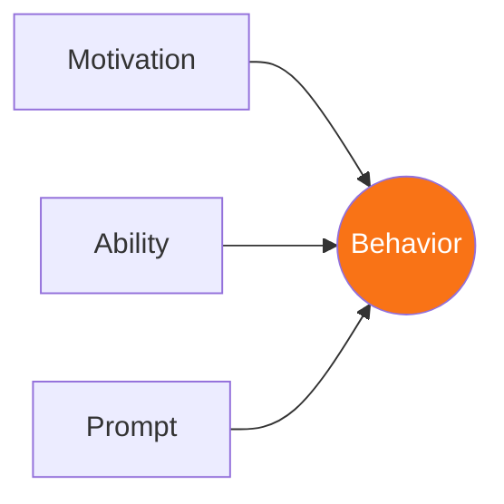
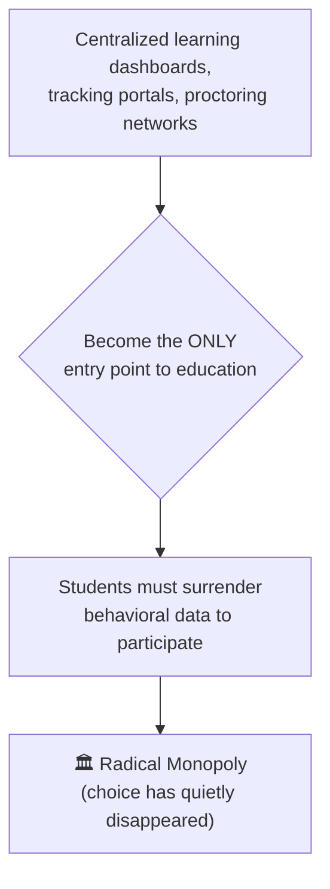

# Module 2: The Attention Gold Rush & Engineered Compliance

## 📖 Core Readings This Week
* **B.J. Fogg**, *Persuasive Technology: Using Computers to Change What We Think and Do* (Chapters 1–3) — [Borrow via Internet Archive](https://archive.org/details/persuasivetechno0000fogg)
* **Audrey Watters**, *Teaching Machines: The History of Personalized Learning* (Chapter 8: "The Skinnerian Panopticon") — [Access Text via Brightspace Course](https://mville.brightspace.com/d2l/le/content/27485/Home)
* **Ivan Illich**, *Tools for Conviviality* (1973) — Chapter 2: "The Radical Monopoly" — [Full text via Internet Archive](https://archive.org/details/toolsforconvivia0000illi)
* **Cory Doctorow**, *"Enshittification"* Selected Essays — [Read the founding essay on Pluralistic](https://pluralistic.net/2023/01/21/potemkin-ai/#compulsory-enshittification)
* **Vatican Note**, *Antiqua et nova* (Section 67: "The Crisis of Rapidification") — [Official English text](https://www.vatican.va/roman_curia/congregations/cfaith/documents/rc_ddf_doc_20250128_antiqua-et-nova_en.html)

---

## 🧠 1. Theoretical Context: EdTech as Behavioral Engineering and Radical Monopoly

This week, we bridge the gap between commercial attention-capture mechanics and the infrastructure of higher education. B.J. Fogg's Behavior Model explains how interfaces engineer action out of three converging factors:

All three have to line up at once — a highly motivated user with a clear prompt still won't act if the task is too hard (low Ability); a trivially easy task still won't get done without a Prompt to trigger it. Audrey Watters argues that modern Educational Technology (EdTech) is engineered around exactly this model, rooted directly in the behaviorist mechanics of B.F. Skinner.

Ivan Illich expands this critique by showing how these automated systems mutate into a **Radical Monopoly**:

> 🏛️ **Radical Monopoly** — when an industrial process exercises exclusive control over the satisfaction of a basic need, eliminating human choice. This goes beyond typical commercial dominance: it's what happens when opting out stops being a real option.

These platforms are marketed using the language of efficiency and personalization. However, as Watters notes, their codebases are engineered to monitor student usage data, track user cadence, and nudge students into predictable execution channels. This mirrors the Vatican's warning in *Antiqua et nova* regarding **"Rapidification"** (§67) — the systematic acceleration of tasks that deskills the human operator and forces them to adapt to the frantic pace of an opaque machine pipeline.

🔍 Go deeper: does a Radical Monopoly need a villain?

It's tempting to read "Radical Monopoly" as a story about a bad actor —
a company that deliberately schemes to trap you. Illich's point is
actually sharper than that, and more unsettling: a Radical Monopoly can
emerge with nobody intending it. Each individual decision along the way
might be locally reasonable — a school adopts a tracking dashboard to
"help" struggling students; a platform adds a feature to "improve"
engagement. No single decision is the villain. The monopoly is the
*sum* of many small, defensible choices, none of which anyone can
point to and say "that one was the problem." This is what makes it
hard to fight through individual accountability — there's rarely one
person or one decision to hold responsible.

---

## 🛠️ Weekly Lab Evaluation Options

| | 💻 Developer Format | 🔍 Analyst Format |
|---|---|---|
| **What you do** | Build a notification engine simulating a behavioral feedback loop | Audit `labs/02-nudge-simulation.html` against Fogg, Watters, and Illich |
| **Best for** | Students who want to build the mechanism themselves | Students who want to diagnose an existing one |
| **Deliverable** | Script + output log | `LAB-SUBMISSION.md` with syslog evidence |

### 🧪 About the Lab Simulation: The Nudge Engine

*The Analyst Format uses this simulation directly. If you're doing the Developer Format, it's worth a few minutes as a reference for the behavior you're building.*

**What this is.** A plain text box with a tracking system running behind it. The system watches how long you go without typing, and it has ideas about what to do about that. You'll be on the receiving end of a nudge, and you'll get to read what the system says about you while it happens.

**How to run it.**
1. Open `labs/02-nudge-simulation.html`. You'll see three counters at the top, a text box, a button, and a log at the bottom.
2. Click into the text box and type a few sentences, anything you like. A line about what you had for breakfast works fine.
3. Click **Initialize Usage Tracking**, then click back into the text box.
4. Type for a bit, then stop and wait. Don't touch anything. See what happens, and how long it takes.
5. Start typing again. See what happens to the alert. Then stop again, and do this a few times.
6. Watch the three counters and the log as you go. Click **Halt Usage Tracking** when you're done. Don't refresh the page until you've copied what you need from the log, because a refresh clears it.

**What to look for.** The timing. Do the alerts come at the same interval every time? Then look at the log. Read what it says about what just happened, and how it describes it.

**Questions to think about.**
- How did it feel? Did you type differently once you knew it was watching? Did you type anything just to make it stop?
- B.J. Fogg says a behavior needs motivation, ability, and a prompt. Which of those is this system working on? Which is it ignoring?
- Who decided that a pause counts as a problem? Was anyone checking whether you were stuck, thinking, or just looking out the window?
- The log records what the system did. It doesn't record what you typed. Is that reassuring? Does it matter?
- Is this persuasion or manipulation? Where does the line fall for you, and what would move it?
- Illich would ask what a convivial version of this workspace looks like. Describe one.

*Time: about 10 minutes.*

### 💻 The Developer Format: The Behavioral Trigger Script
1. Write a script that simulates a standard platform feedback loop. Build a notification engine that tracks user inactivity (in seconds) and dynamically fires automated alerts using varying intervals based on Fogg's behavior variables ($B=MAP$).
2. **Deliverable:** Commit your script and an output log showing how your trigger intervals vary to optimize user engagement and minimize platform drop-off.

### 🔍 The Analyst Format: The Manipulative Interface Audit
1. Launch the file `labs/02-nudge-simulation.html` inside your local browser. Click "Initialize Usage Tracking" and interact with the input box.
2. Execute a rigorous structural audit documenting how the platform utilizes Fogg's behavior variables, Audrey Watters' criteria for Skinnerian engineering, and **Ivan Illich's definitions of a Radical Monopoly**:

   | Diagnostic | What to look for |
   |---|---|
   | **The Stimulus Loop** | How the simulation uses background checks to deploy the orange overlay, monitoring your interaction drop-off |
   | **The Telemetry Gaze** | How the background script monitors student usage data timing down to the tenth of a second (`0.1s`) |
   | **The Enforced Compliance** | How variable-ratio notification triggers deny a user the freedom to think or work outside the software's closed boundaries, per Section 67 of *Antiqua et nova* and Illich's *Radical Monopoly* |

3. **Deliverable:** Commit your completed audit file (`LAB-SUBMISSION.md`) to your repository. Copy your background syslog stream into the entry to verify the automated trigger timestamps.
