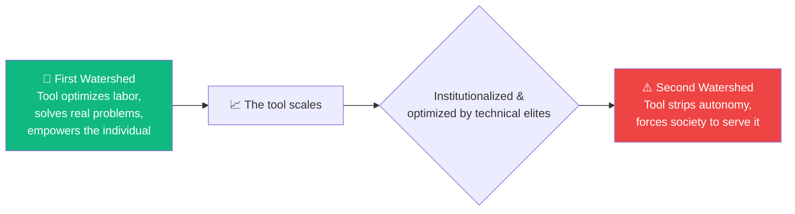
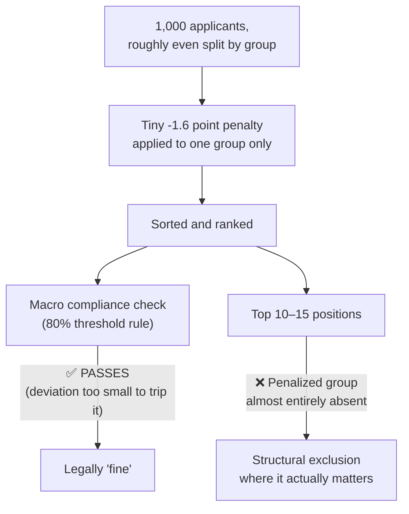

# Module 3: Algorithmic Systems & The Optimization Trap

## 📖 Core Readings This Week
* **Cathy O'Neil**, *Weapons of Math Destruction* (Chapters 1–3) — [Borrow via Internet Archive](https://archive.org/details/weaponsofmathdes0000onei)
* **Ivan Illich**, *Tools for Conviviality* (1973) — Chapter 1: "The Two Watersheds" — [Full text via Internet Archive](https://archive.org/details/toolsforconvivia0000illi)
* **AlgorithmWatch**, *Managed by the Algorithm: How AI is Changing the Way We Work* (Workplace Automation Index) — [Read on AlgorithmWatch](https://algorithmwatch.org/en/automated-decision-making-workplace/)
* **Alkhathlan, Shrestha, Harrison & Rundensteiner**, *"Exploring 'Just Noticeable' Group Fairness in Rankings"* (AIES 2025) — [Official proceedings link](https://ojs.aaai.org/index.php/AIES/article/view/36532)

---

## 🧠 1. Theoretical Context: The Second Watershed of Automated Management

We expand Cathy O'Neil's structural analysis of automated models by exploring how algorithms systematically reshape modern labor. Independent investigations by **AlgorithmWatch** demonstrate that automated decision-making (ADM) systems are actively deployed to continuously log employee performance data, track physical movement telemetry, and generate automated retention scores that predict which workers to target for termination.

To fully conceptualize this threat, we apply Ivan Illich's historical law of **The Two Watersheds**:

Modern optimization algorithms, predictive hiring platforms, and deep ranking models have crossed this Second Watershed. They no longer connect people or ease burdens; they function as invisible corporate managers that flatten human lives into optimized, un-auditable data matrices.

This manifests clearly in the ACM/AIES discovery of **"Just Noticeable" Bias** (Alkhathlan et al.). Optimization models rarely fail in catastrophic or obvious ways — instead, they introduce a penalty too small to trip a compliance check, but large enough to matter once concentrated at the top of a ranked list:

The penalty passes the legal test and fails the actual people affected — that gap is the whole point of "Just Noticeable" bias.

🔍 Go deeper: why this is genuinely hard to legislate against

It's tempting to think the fix is just "lower the compliance threshold"
or "check more carefully." But the 80% rule (or any similar
threshold-based test) has to draw a line somewhere, and wherever it
draws that line, a sufficiently small, sufficiently well-targeted
penalty can be built to sit just inside it. This isn't a loophole
regulators forgot to close — it's closer to a structural feature of
*any* threshold-based compliance test. Alkhathlan et al.'s contribution
isn't just "here's a bias," it's "here's a bias engineered to be
mathematically invisible to the exact kind of check the law actually
uses." That's a much harder problem than catching a one-off bad actor.

---

## 🛠️ Weekly Lab Evaluation Options

| | 💻 Developer Format | 🔍 Analyst Format |
|---|---|---|
| **What you do** | Build your own ranking simulation with a hidden penalty | Run the provided simulation and interpret its output |
| **Best for** | Students who want to construct the mechanism | Students who want to audit an existing one |
| **Deliverable** | Script + distribution graph | `LAB-SUBMISSION.md` with both test runs recorded |

### 💻 The Developer Format: The Just-Noticeable Ranking Audit
1. Write a script to simulate an institutional recruitment portal that ranks 1,000 applicants based on a synthetic performance score variable.
2. Introduce a hidden "Just Noticeable" loop: inject a minor 1.6-point performance-score penalty that targets candidates passing a non-protected proxy data point (e.g., graduated from a specific array of zip codes). This mirrors the penalty built into `labs/03-bias-simulation.html`, so your results should be directly comparable to the Analyst Format's.
3. **Deliverable:** Commit your script. Generate an output distribution graph showing how a standard, macro-level compliance audit completely misses this small deviation, while your timeline analysis proves the targeted demographic is entirely stripped of top-10 ranking positions by the end of the pipeline.

### 🔍 The Analyst Format: The Second Watershed Forensic Audit
1. Open `labs/03-bias-simulation.html` in your browser.
2. **Test Run 1:** Click the "Run Standard Baseline Array" button. Record the Disparate Impact Ratio and the output demographic distribution in the top 15 ranks.
3. **Test Run 2:** Click the "Deploy Opaque Optimization Model" button. Record the new Disparate Impact Ratio. Observe the Audit Compliance status box. Note the change in how many purple Group Beta candidates manage to retain placement flags inside the top 10 positions.
4. **Deliverable:** Commit an audit analysis report (`LAB-SUBMISSION.md`) to your repository. Using **Alkhathlan et al. (AIES)** and **Ivan Illich's Second Watershed criteria**, explain how the hidden 1.6-point reduction passes legal regulatory checklist formulas perfectly while completely executing structural exclusion at the pipeline's peak. Detail how this software has mutated from an empowering utility into an oppressive institutional monopoly.
