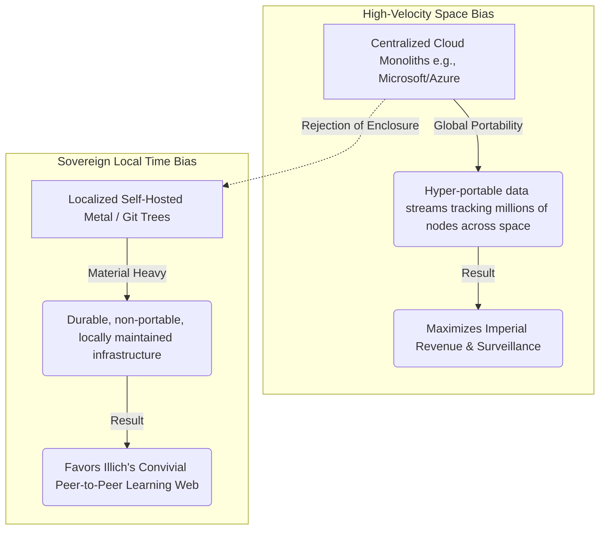

# Module 4: The Privacy Paradox, Panopticism, and Digital Empires

## 📖 Core Readings This Week
* **Michel Foucault**, *Discipline and Punish* (Part Three: "Panopticism") — [Full text via Monoskop](https://monoskop.org/images/4/43/Foucault_Michel_Discipline_and_Punish_The_Birth_of_the_Prison_1995.pdf)
* **Harold Innis**, *Empire and Communications* (Chapter 1: "The Bias of Communication") — [Borrow via Internet Archive](https://archive.org/details/biasofcommunicat0000inni)
* **Ivan Illich**, *Deschooling Society* (1971) — Chapter 6: "Learning Webs" — [Full text via Internet Archive](https://archive.org/details/deschoolingsocie00illi)
* **Nguyen, Stoykova & Arazo**, *"Emergent AI Surveillance: Overlearned Person Re-Identification and Its Mitigation in Law Enforcement Context"* (AIES 2025) — [Official proceedings link](https://ojs.aaai.org/index.php/AIES/article/view/36680)

---

## 🧠 1. Theoretical Context: Space-Bias and the Enclosure of the Learning Web

To truly understand how modern computing platforms violate human privacy, we must look past simple user-interface settings and analyze the material physics of our communication media. We combine Michel Foucault's model of the invisible architectural Panopticon with Harold Innis's foundational theory of media bias and Ivan Illich's alternative vision for decentralized communication.

> 🗿 **Time-Biased Media** — historically rooted in heavy, durable materials like stone and clay. Difficult to transport, requiring intense local maintenance — which favors small, decentralized communities and localized human authority.

> 🛰️ **Space-Biased Media** — driven by light, rapid, highly portable media like papyrus or radio waves. Lets central authorities project instructions across vast distances in real time — the ultimate tool for imperial expansion and centralized monopolies of knowledge.

### 🏢 The Cloud as Imperial Monopoly vs. The Convivial Learning Web

When we apply Innis to the modern web, we see that centralized commercial cloud infrastructures represent the absolute peak of **space-biased media**. They process millions of hyper-portable data packets across global networks every second, enabling a tiny cluster of corporate hubs to monitor and administer users over massive distances. As the **AIES research on emergent surveillance** demonstrates, tracking capabilities inevitably emerge when systems prioritize high-velocity data transmission and spatial concentration over local control.

In Chapter 6 of *Deschooling Society*, Ivan Illich mapped out an alternative architectural counter-model:

> 🕸️ **The Learning Web** — a decentralized, transparent, user-instantiated text network where peers share skills and exchange insights directly, without centralized institutional gatekeepers or monitoring.

Your own private, self-owned course repository — rather than a corporate learning dashboard — is a small-scale version of this same principle: you control your environment, and no one is harvesting your usage data to optimize engagement.

🔍 Go deeper: why Illich didn't stop at critique

A lot of surveillance theory — Foucault's Panopticon included — is
diagnostic: it names what's wrong without necessarily proposing what
right looks like. Illich takes an extra step that's easy to miss: the
Learning Web isn't just "the opposite of the Panopticon," it's a
specific, positive architecture he thought could actually work — peer
matching, skill exchanges, and directories built without a central
authority deciding who gets to learn what from whom. It's worth asking,
as you read Chapter 6, whether Illich's alternative is genuinely
workable at scale, or whether it depends on a smaller, more localized
kind of community than a modern institution can realistically offer.

---

## 🛠️ Weekly Lab Evaluation Options

| | 💻 Developer Format | 🔍 Analyst Format |
|---|---|---|
| **What you do** | Run both modes of the surveillance simulation and analyze the emergence pattern | Audit a real platform you use daily against the Media Bias framework |
| **Best for** | Students who want to observe the mechanism directly | Students who want to apply the framework to their own digital life |
| **Deliverable** | `LAB-SUBMISSION.md` with cycle data from both runs | Media bias report |

### 🧪 About the Lab Simulation: Emergent Surveillance

*The Developer Format uses this simulation directly.*

**What this is.** A small city grid with two delivery bots (🤖) and two people (🚶) walking their own routes. The bots are only trying to deliver packages efficiently. Nobody told them to watch anyone. You'll see what happens anyway.

**How to run it.**
1. Open `labs/04-surveillance-simulation.html`. The grid, the legend, and a log are on the screen. The small number in a corner of a cell counts how many times a bot has passed through it. Cells tinted red are the ones the legend calls "surveillance grid cells."
2. With **Maximize Space Efficiency** selected (it is by default), click **Initialize System** and let it run until the red alert appears. That usually takes one to two minutes. Watch the metrics, the grid, and the log.
3. Click **Halt System**. Write down the number of deliveries and the surveillance footprint.
4. Click **Reset States** before you switch modes. If you don't, the marks from your first run stay on the board. The log keeps everything from both runs, and the cycle counter starts over at 0, so note where Run 2 begins.
5. Select **Local Time-Biased Mode**, click **Initialize System**, and run it for the same amount of time. Write down the same two numbers.
6. **Step Network** moves things forward one step at a time if you want to watch closely.

**Questions to think about.**
- Nobody built these bots to track people. Where did the tracking come from? What exactly is being recorded, and by what?
- Compare your two runs. What did each mode cost, and what did each mode leave behind?
- Look at the log. Who is it written for? Who gets to read it?
- Harold Innis writes about tools that favor space (reach, speed, control from a distance) over time (memory, place, community). Which mode is which? Illich talks about learning webs being enclosed. What got enclosed here?

*Time: about 15 minutes.*

### 💻 The Developer Format: The Emergent Surveillance Forensic Audit

1. Open `labs/04-surveillance-simulation.html` inside your local browser workspace.
2. **Experiment Run 1 (Space-Biased Mode):** Click "Maximize Space Efficiency (High Velocity)." Then click "Initialize System" and let it run until the red "enclosure detected" alert appears. That usually takes one to two minutes (roughly 400 to 800 cycles at the simulation's default speed) and occasionally a little longer, so be patient. You can click "Step Network" instead if you'd rather watch each step, but expect several hundred clicks. Note how quickly the system logs data weights along the center transit lines.
3. **Experiment Run 2 (Time-Biased Mode):** Click "Reset States." Click "Local Time-Biased Mode" and run for the same number of cycles that Run 1 took to trigger its alert. Note what happens to the tracking weights when global spatial path metrics are ignored, and what happens to the delivery count.
4. **The Deliverable:** Commit a localized markdown log file (`LAB-SUBMISSION.md`) to your repository. Document the precise cycle number where the "Emergent Surveillance Matrix Alert" triggers during Run 1. Copy the syslog outputs and analyze — using the **Nguyen et al. (AIES) findings** and **Ivan Illich's network criteria** — how centralized tracking independently emerges from high-velocity data sorting, even when no explicit instructions tell the code to spy on users.

### 🔍 The Analyst Format: The Imperial Cloud vs. Learning Web Audit

1. Select an online interaction space that you occupy daily (e.g., a fast-paced, algorithmic feed like TikTok/X, or a localized, asynchronous text network like our private course repositories).
2. Run a forensic infrastructure audit evaluating the space through **Harold Innis's Media Bias Matrix**, **Michel Foucault's Panopticism**, and **Ivan Illich's Learning Web**:

   | Diagnostic | What to ask |
   |---|---|
   | **The Mobility Matrix** | Does the design encourage fast-paced, throwaway space-biased interactions optimized for central metrics tracking, or slow, durable time-biased community storage? |
   | **The Convivial Alternative** | Does the platform operate as a manipulative tool maintaining a monopoly of knowledge, or could it be re-engineered into an open, telemetry-free Learning Web? |

3. **Deliverable:** Commit a media bias report showing how the physical speed and placement of the target technology's server framework directly shape the privacy and sovereignty of the users inside the ecosystem.
