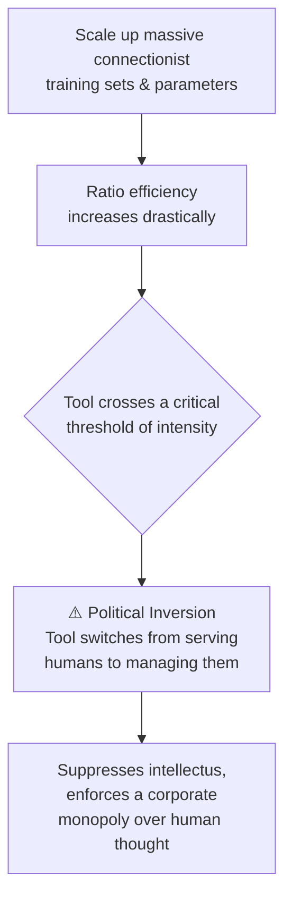

# Module 5: The AI Frontier and the Human Person

## 📖 Core Readings This Week
* **Hubert L. Dreyfus**, *Alchemy and Artificial Intelligence* (1965 RAND Corporation Technical Report) — [Official RAND page](https://www.rand.org/pubs/papers/P3244.html)
* **Pope Leo XIV**, *Magnifica Humanitas: On Safeguarding the Human Person in the Time of AI* (2026 Encyclical) — [Official Vatican text](https://www.vatican.va/content/leo-xiv/en/encyclicals/documents/20260515-magnifica-humanitas.html)
* **Emily M. Bender, Timnit Gebru, et al.**, *"On the Dangers of Stochastic Parrots: Can Language Models Be Too Big?"* (ACM FAccT) — [Author's free copy](https://faculty.washington.edu/ebender/papers/Stochastic_Parrots.pdf)
* **AlgorithmWatch Report**, *The AI Climate Hoax: Behind the Curtain of How Big Tech Greenwashes Impacts* (June 2026) — [Read the report](https://algorithmwatch.org/en/ai-climate-hoax/)
* 📺 *Media Screening:* [Pope Leo XIV's AI Encyclical Explained (w/ Fr. Gregory Pine)](https://www.youtube.com/watch?v=cpptgvohfZc)

---

## 🧠 1. Theoretical Context: The First AI Winter, the Alchemy Error, and Political Inversion

To properly evaluate connectionist architectures and Large Language Models, we must recognize that the philosophical battle over automated cognition is over sixty years old. We ground our contemporary AI critique in Hubert Dreyfus's foundational 1965 text, *Alchemy and Artificial Intelligence*, and Ivan Illich's critique of technical over-specialization.

### ⚗️ A. The Alchemy Analogy
Dreyfus observed that early AI pioneers achieved quick, striking successes in narrow domains, leading them to announce that human-level artificial intelligence was just around the corner. Dreyfus warned that this pattern was identical to ancient alchemy: alchemists successfully managed to distill quicksilver from dirt, but their progress hit a hard, structural wall because they misread the underlying chemistry of the material. His core warning: early momentum in a direction is no proof at all that continuing the same path leads anywhere near the actual goal.

### 🧱 B. The Three Excluded Human Elements
Dreyfus argued that digital computers process information sequentially and discursively. In doing so, formal computer code systematically excludes three core human cognitive capacities that cannot be reduced to explicit rules:

| Element | What it means |
|---|---|
| **Ambiguity Tolerance** | Operating fluidly within vague, shifting, open-ended human contexts without crashing or requiring infinite data parameters |
| **Essence/Accident Discrimination** | The intuitive ability to distinguish what's essential to a situation from what's merely incidental |
| **Fringe Consciousness** | The background awareness of our physical bodies, histories, and environments that informs every human choice |

### 🗺️ Illich's Technical Inversion Trap

> ⚙️ **Ratio** — discursive, rule-based, mathematical optimization. What a computer does natively.

> 🕯️ **Intellectus** — intuitive, embodied human conscience. What Dreyfus's three excluded elements point toward, and what no amount of scaling produces.

### 🕸️ C. The Link to 2026 Frameworks & Political Inversion

This alchemical limit maps directly to Ivan Illich's concept of **Political Inversion**. Illich warns that when tools grow past a certain intensity, they switch from serving mankind to enslaving mankind, creating an administrative techno-bureaucracy that erases human agency. Large language models and predictive transformers represent the ultimate tool inversion: tools built on collected human language that are now deployed to manage, replace, and automate human *intellectus* entirely.

> 🗼 **"Babel Syndrome"** (Leo XIV, §12) — the systemic illusion that individual conscience can be flattened into connectionist probability profiles.

> 🌐 **Universal Destination of Data** (Leo XIV, §66) — algorithms, training sets, and infrastructure networks are common heritage assets, not absolute corporate property.

This corporate enclosure hides a massive material cost. While tech conglomerates market AI as an abstract, environmentally clean cloud layer, **AlgorithmWatch's 2026 investigative data** exposes the material reality: a massive surge in carbon emissions and hidden local water consumption, combined with systematic corporate lobbying to keep data center utility metrics hidden from public NGO scrutiny.

---

## 🛠️ Weekly Lab Evaluation Options

| | 💻 Developer Format | 🔍 Analyst Format |
|---|---|---|
| **What you do** | Build a carbon-cost estimator script | Run the alchemy simulation across all three nodes |
| **Best for** | Students who want to quantify environmental cost | Students who want to test where "Ratio" breaks down |
| **Deliverable** | Script + execution config | `LAB-SUBMISSION.md` |

### 💻 The Developer Format: The Material Carbon Estimator

1. Write a local automation script (`carbon_estimator.py`) that acts as an infrastructure carbon calculator. Your script must read a local text file processing load, estimate processing durations across different server topologies, and compute the estimated grid carbon output based on the active utility emission profiles exposed in the June 2026 AlgorithmWatch report.
2. **Deliverable:** Commit your script and an execution configuration model. Contrast the environmental efficiency claims of central commercial cloud architectures against the carbon footprint of a localized, self-hosted campus server node.

### 🔍 The Analyst Format: The Alchemy Limit Assessment

1. Open `labs/05-alchemy-simulation.html` in your workspace browser.
2. Run your audit sequence through **Node A (Ratio Model)**, **Node B (Ambiguity Matrix)**, and **Node C (Fringe Context Matrix)**, in any order — each is independent and doesn't build on the previous selection. Observe the automated engine output responses and exceptions for each.
3. **Deliverable:** Commit an audit evaluation report (`LAB-SUBMISSION.md`). Using **Hubert Dreyfus's alchemical pillars** and **Ivan Illich's Political Inversion framework**, break down why the "Ratio" checklist fails to safely navigate human crises. Explain how the system crashes under nodes B and C, proving that scaling up statistical data parameters does not lead closer to human understanding (*intellectus*), but simply refines a manipulative, rule-bound simulation.
